```{r setup, include = FALSE}
options(htmltools.dir.version = FALSE)
library(knitr)
library(metathis)
library(xaringanExtra)
library(showtext)
library(kableExtra)
library(icons)
opts_chunk$set(echo=FALSE)

# set engines
knitr::knit_engines$set("markdown")

xaringanExtra::use_panelset()
# xaringanExtra::use_share_again()
xaringanExtra::use_tile_view()

```

```{r xaringan-themer, include=FALSE, warning=FALSE}
library(xaringanthemer) 
style_mono_light(base_color = "#23395b")
```

```{r meta, echo=FALSE}
meta() %>%
  meta_general(
    description = "Patterns of Thoracic Metastatic Disease",
  ) %>% 
  meta_name("github-repo" = "howardm") %>% 
  meta_social(
    title = "Thoracic Radiology",
    url = "https://howardm.github.io/PatternsofMetastaticDisease",
    image = "http://howardmann.us/twitter-card1.jpg",
    image_alt = "",
    og_type = "website",
    og_author = "Howard Mann",
    twitter_card_type = "summary_large_image",
    twitter_creator = "@howardm19"
  )
```  


class: inverse, center, middle

## Patterns of Thoracic Metastatic Disease


### .blue[Howard Mann, M.D.]


```{r icon-style}
icon_style(fontawesome("link"), scale = 1, fill = "white")
```
howardmann.us


```{r icon-stylex}
icon_style(fontawesome("paper-plane"), scale = 1, fill = "white")
```
howard.mann@utah.edu

### University of Utah  |  Department of Radiology and Imaging Sciences

### December 1st, 2021


---
class: center, middle

When first starting the presentation, allow a minute or so for CT data to download into the viewers.
<br>


<!----------------------------- SLIDE BREAK ----------------------------->

---

layout: true

background-image: url(images/circle-cropped.png)
background-position: 98% 1%
background-size: 4%

---
class: middle

.big[.blue[Introduction]

Thoracic metastatic disease is generally considered when one or more of the following are present: pulmonary nodules, pleural fluid, and nodal enlargement. Of course, this is correct--most of the time.

For this presentation, your task is to identify and explicate a different--a *particular*--pattern of metastatic disease in each presented case. These will be uncommon-to-rare presentations.

After viewing the Clinical Presentation, view the imaging in the succeeding tabs, and volunteer to succinctly describe the pattern during the talk.]


<!----------------------------- SLIDE BREAK ----------------------------->
---

class: inverse
name: case 1

.blue[Case 1]


.panelset[

.panel[.panel-name[Clinical Presentation]

A patient with leg pain.

] <!--end of panel-->

.panel[.panel-name[Imaging]

.pull-left[

]

.pull-right[


]

] <!--end of panel-->


.panel[.panel-name[Explanation]

.big[Diagnosis: metastatic osteosarcoma

.grey[Key Point: A completely calcified nodule is a benign SPN .white[*except*] when the patient has a primary bone- or cartilage-forming malignancy]]

] <!--end of panel-->

] <!--end of panelset-->

<!----------------------------- SLIDE BREAK ----------------------------->

---

class: inverse
name: case 2 

.blue[Case 2 ]


.panelset[

.panel[.panel-name[Clinical Presentation]

A patient with colon cancer.

] <!--end of panel-->

.panel[.panel-name[Imaging]

<br>
.pull-left[


]

.pull-right[


]

] <!--end of panel-->

.panel[.panel-name[Explanation]

.big[Diagnosis: a metastasis

.gray[Keypoints

* When a calcification(s) occupies a small part of the nodule, and is eccentric in location, it is not always a benign lesion

* when the patient has a cancer, one's index of suspicion is heightened

]]


] <!--end of panel-->


] <!--end of panelset-->

<!----------------------------- SLIDE BREAK ----------------------------->

---
class: inverse
name: case 3 

.blue[Case 3 ]


.panelset[

.panel[.panel-name[Clinical Presentation]

You should be able to discern (subtle!) the likely primary tumor

] <!--end of panel-->

.panel[.panel-name[Imaging]

.pull-left[

]

.pull-right[

]


] <!--end of panel-->

.panel[.panel-name[Explanation]

.pull-left[.big[Diagnosis: a *miliary pattern* of metastases

Slight leftward deviation of the trachea is consistent with a thyroid mass]]

.pull-right[


]

] <!--end of panel-->


] <!--end of panelset-->

<!----------------------------- SLIDE BREAK ----------------------------->

---

class: inverse
name: case 4

.blue[Case 4]


.panelset[

.panel[.panel-name[Clinical Presentation]

The patient presented with abdominal pain, neck pain, and a scrotal mass.

] <!--end of panel-->

.panel[.panel-name[Imaging]

.pull-left[

]

.pull-right[

]


] <!--end of panel-->

.panel[.panel-name[Explanation]

.big[Diagnosis: choriocarcinoma metastases

.grey[Keypoints

* When a solid nodule is surrounded by a .white[*halo*] of ground glass opacity, the latter may (but not always) indicate hemorrhage

* this is described wih choriocarcinoma and vascular tumors, such as angiosarcomas

* it may occur with malignant melanoma]]

] <!--end of panel-->


] <!--end of panelset-->

<!----------------------------- SLIDE BREAK ----------------------------->

---

class: inverse
name: case 5

.blue[Case 5]


.panelset[

.panel[.panel-name[Clinical Presentation]

A skin lesion.

] <!--end of panel-->

.panel[.panel-name[Imaging]

.pull-left[

]

.pull-right[

]


] <!--end of panel-->

.panel[.panel-name[Explanation]

.big[Diagnosis: Cystic metastases of a skin angiosarcoma with secondary spontaneous pneumothorax.

.grey[Keypoints

* cystic metastases occur -- particularly with sarcomas. 
* sometimes these result from progressive cavitation of solid metastases, for example, with treated urothelial and colon cancers
* thin-walled cysts may be the presentation of these metastases, for example, with an extremity epithelioid cell sarcoma. 

.pull-left.w30[

````markdown
The last may be a gotcha!
````
]

]]

] <!--end of panel-->

] <!--end of panelset-->


<!----------------------------- SLIDE BREAK ----------------------------->

---

class: inverse
name: case 6

.blue[Case 6]


.panelset[

.panel[.panel-name[Clinical Presentation]

Biliary tract cancer

] <!--end of panel-->

.panel[.panel-name[Imaging]

.pull-left[

.blue[March 2017]

]

.pull-right[

.blue[January 2018]

]


] <!--end of panel-->

.panel[.panel-name[Explanation]

.pull-left.w30[

<br>
Diagnosis: A *lepidic pattern* (presumed) of tumor growth in metastases.]

.pull-right.w70[

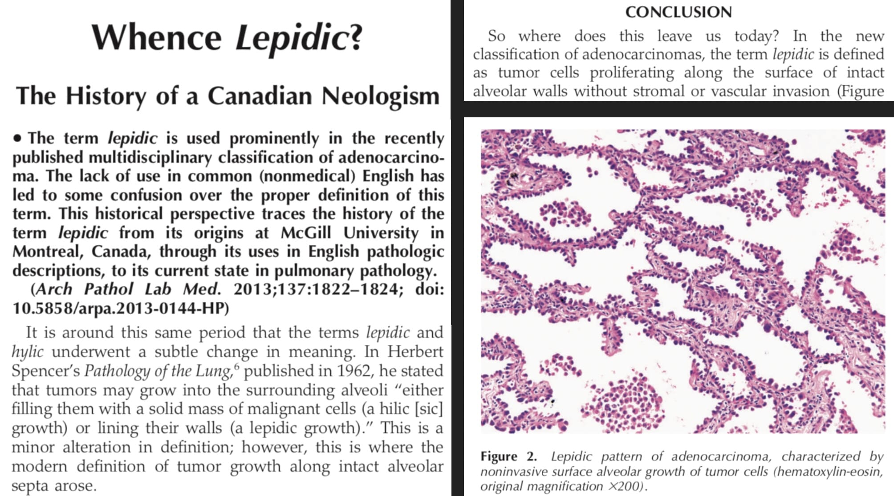

]


] <!--end of panel-->

] <!--end of panelset-->


<!----------------------------- SLIDE BREAK ----------------------------->

---

class: inverse
name: case 7

.blue[Case 7]


.panelset[

.panel[.panel-name[Clinical Presentation]

Endometrial cancer

] <!--end of panel-->

.panel[.panel-name[Imaging]

.pull-left[


]

.pull-right[


]


] <!--end of panel-->


.panel[.panel-name[Explanation]

.pull-left.w30[

<br>
Diagnosis: An endotracheal metastasis (easily escapes perception!).]

.pull-right.w70[

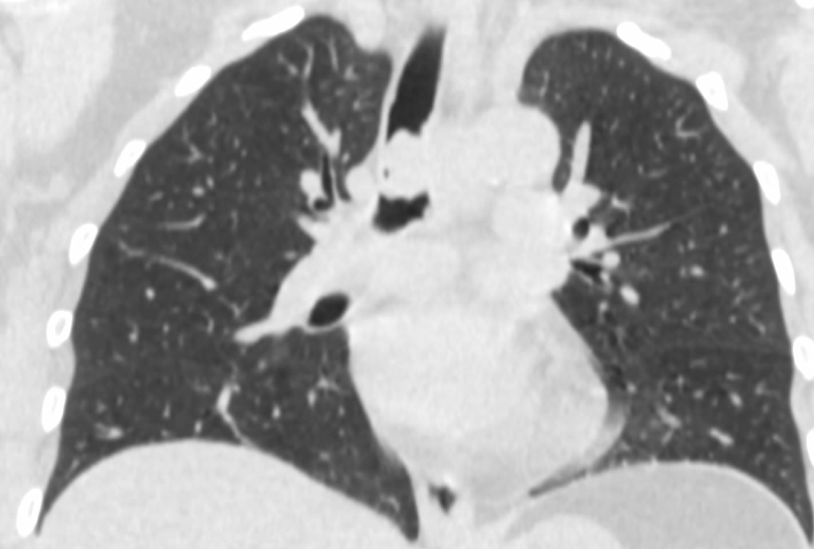]


] <!--end of panel-->


] <!--end of panelset-->


<!----------------------------- SLIDE BREAK ----------------------------->

---

class: inverse
name: case 8

.blue[Case 8]


.panelset[

.panel[.panel-name[Clinical Presentation]

A patient with gastric cancer and hemoptysis.

] <!--end of panel-->

.panel[.panel-name[Imaging]

<div style="text-align:center;">
<iframe class="pacsbin"
         id="case8"
         src="https://www.pacsbin.com/c/bkMOqZEpcP?s=61a173eb2c3c7213840ef58e&i=61a173eb2c3c7213840ef5c4&ww=1432&wc=-504an=false&header=false&notes=false&overlay=true" 
         style="width: 500px; height: 500px; border: 0;"></iframe>
</div>

] <!--end of panel-->


.panel[.panel-name[Explanation]

.pull-left.w30[

<br>
Diagnosis: Endotracheal and peri-carinal endobronchial metastases.]

.pull-right.w70[

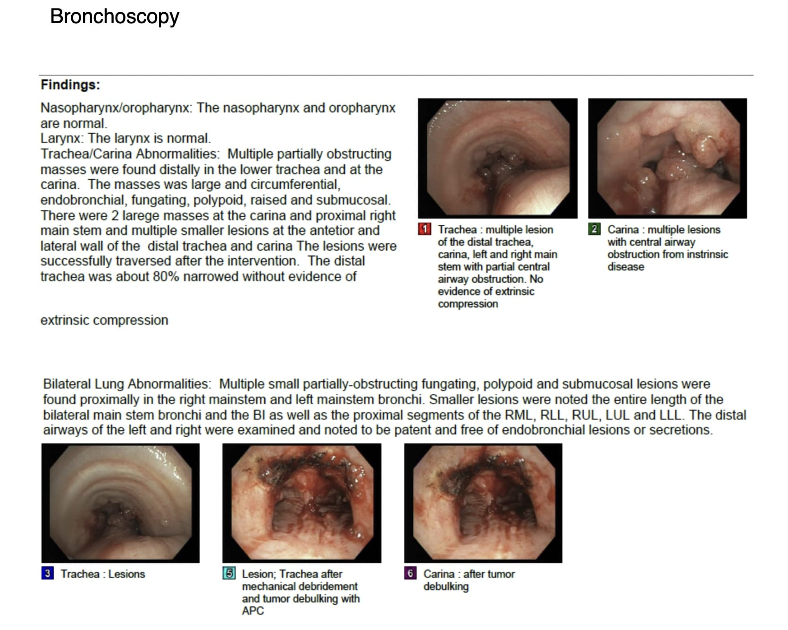]


] <!--end of panel-->


] <!--end of panelset-->


<!----------------------------- SLIDE BREAK ----------------------------->

---

class: inverse
name: case 9

.blue[Case 9]


.panelset[

.panel[.panel-name[Clinical Presentation]

A patient with uterine sarcoma

] <!--end of panel-->

.panel[.panel-name[Imaging]

.center[]


] <!--end of panel-->

.panel[.panel-name[Explanation]

.pull-left.w30[

<br>
Diagnosis: Endobronchial metastasis producing obstructive lobar collpase.]

.pull-right.w70[

<br>
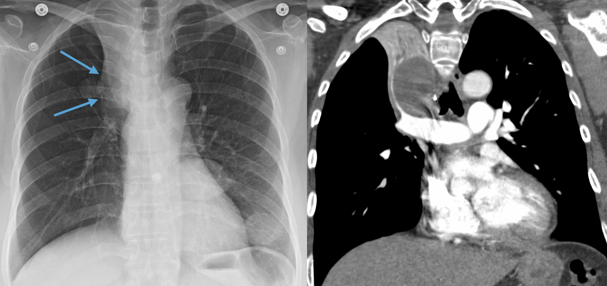]


] <!--end of panel-->

] <!--end of panelset-->


<!----------------------------- SLIDE BREAK ----------------------------->

---


class: inverse
name: case 10

.blue[Case 10]


.panelset[

.panel[.panel-name[Clinical Presentation]

A patient with ovarian cancer

] <!--end of panel-->

.panel[.panel-name[Imaging]


] <!--end of panel-->

.panel[.panel-name[Explanation]

.pull-left.w30[

<br>
Diagnosis: Another case of endobronchial metastasis producing obstructive lobar collpase.]

.pull-right.w70[

<br>
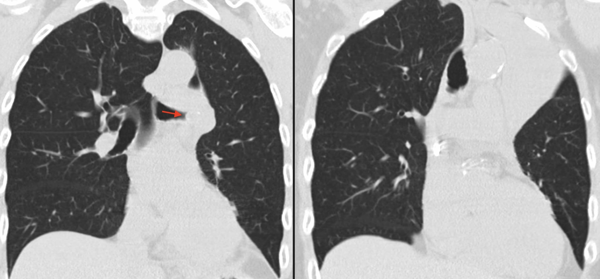]

] <!--end of panel-->

] <!--end of panelset-->


<!----------------------------- SLIDE BREAK ----------------------------->

---

class: inverse
name: case 11

.blue[Case 11]


.panelset[

.panel[.panel-name[Clinical Presentation]

A patient with a sacral cordoma

] <!--end of panel-->

.panel[.panel-name[Imaging]

<div style="text-align:center;">
<iframe class="pacsbin"
         id="case8"
         src="https://www.pacsbin.com/c/-JInJdETqw?s=61a17e0e2c3c7213840ef90c&i=61a17e0e2c3c7213840ef939&ww=400&wc=40an=false&header=false&notes=false&overlay=true" 
         style="width: 500px; height: 500px; border: 0;"></iframe>
</div>

] <!--end of panel-->

.panel[.panel-name[Explanation]

.pull-left.w20[

<br>
Diagnosis: Intra-vascular metastases]

.pull-right.w80[

.pull-left[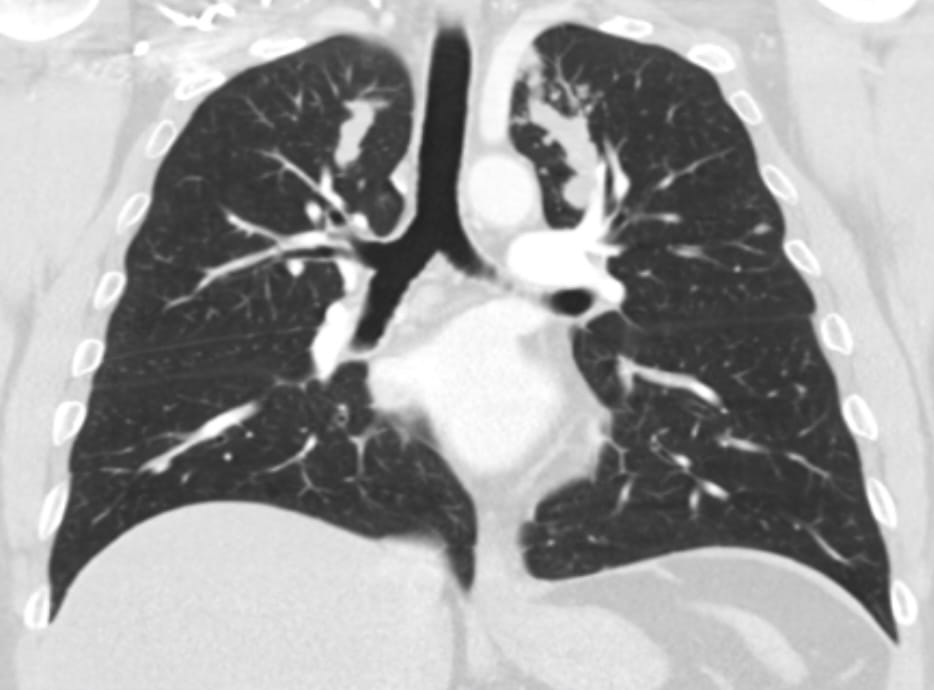]


.pull-right[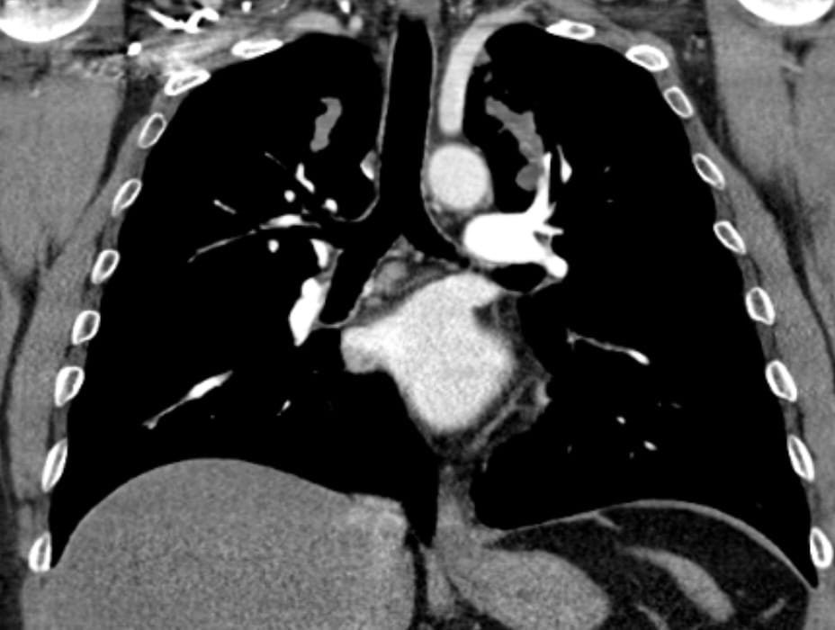]

]

] <!--end of panel-->

] <!--end of panelset-->


<!----------------------------- SLIDE BREAK ----------------------------->

---


class: inverse
name: case 12

.blue[Case 12]


.panelset[

.panel[.panel-name[Clinical Presentation]

A patient with esophageal cancer

] <!--end of panel-->

.panel[.panel-name[Imaging I]

<div style="text-align:center;">
<iframe class="pacsbin"
         id="case8"
         src="https://www.pacsbin.com/c/-JCXy5Ea5v?s=61a181442c3c7213840ef96b&i=61a181442c3c7213840ef9ad&ww=1370&wc=-535an=false&header=false&notes=false&overlay=true" 
         style="width: 500px; height: 500px; border: 0;"></iframe>
</div>

] <!--end of panel-->


.panel[.panel-name[Imaging II]

<br>

.pull-left[


]


.pull-right[


]

] <!--end of panel-->

.panel[.panel-name[Explanation]

.pull-left.w30[

<br>
Diagnosis: Intravascular metastases in lobular arteries -- *vascular tree-in-bud sign*.

.grey[Keypoints:

* MIPS images are very helpful in perceiving the tubular nature of the centrilobular opacities
* carefully follow the tubular opacities proximally to confirm that they are arteries]


]

.pull-right.w70[

<br>
.center[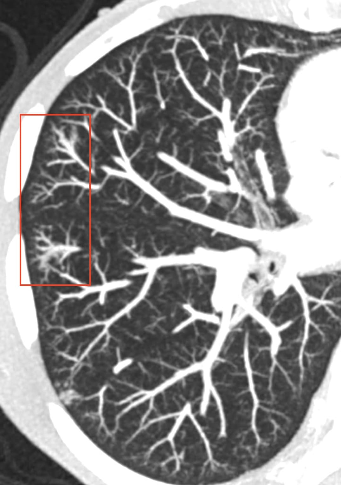]]

] <!--end of panel-->


] <!--end of panelset-->


<!----------------------------- SLIDE BREAK ----------------------------->

---

class: inverse
name: case 13

.blue[Case 13]


.panelset[

.panel[.panel-name[Clinical Presentation]

A patient with prostate cancer. He developed findings of pulmonary arterial hypertension.   
<br>
No pulmonary opacities are present on imaging.

] <!--end of panel-->

.panel[.panel-name[Imaging I]

.center[]

] <!--end of panel-->


.panel[.panel-name[Imaging II]

<br>

```{r fig.align='center', out.width='100%'}
knitr::include_graphics("images/13b.jpg")
```


] <!--end of panel-->

.panel[.panel-name[Explanation]

.pull-left.w20[

Diagnosis: Pulmonary Hypertension from *intravascular tumor thrombotic microangiopathy*

A difficult diagnosis to make:

-- a mosaic attenuation pattern may be subtle or absent   

--  a centrilobular *vascular tree-in-bud pattern* is typically not present]

.pull-right.w80[

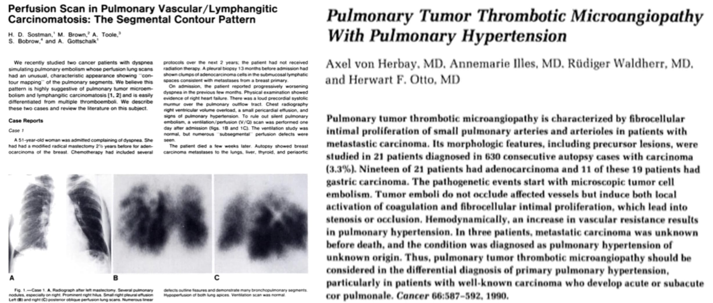
]

] <!--end of panel-->


] <!--end of panelset-->


<!----------------------------- SLIDE BREAK ----------------------------->

---

class: inverse
name: case 14 

.blue[Case 14 ]


.panelset[

.panel[.panel-name[Clinical Presentation]

Three patients with the same pattern of metastatic disease

] <!--end of panel-->

.panel[.panel-name[Patient 1]

.center[]

] <!--end of panel-->

.panel[.panel-name[Patient 2]

Primary left upper lobe lung cancer

.center[]


] <!--end of panel-->

.panel[.panel-name[Patient 3]

Primary right lower lobe cancer


.center[]

.panel[.panel-name[Explanation]

Diagnosis: Lymphangitic spread of tumor

.grey[Keypoints:

* the manifestations of lymphangitic tumor spread represent a consequence of tumor obstruction of pulmonary lymphatics:

-- a small, net (_physiologic_) transcapillary hydrosatic pressure gradient results in passage of fluid into the interstitium
<br>
-- when lymphatics are obstructed clearance of this lung water is impaired
<br>
-- accumulation of interstitial lung water is manifested by imaging findings of interstitial edema: peri-bronchial fluid cuffs; septal lines; and subpleural edema in relation to interlobar fissures

* the septal lines need not be "beaded" to suggest this diagnosis
* pleural effusions may occur
* the interstitial edema may be focal and asymmetric
* sometimes, abnormal FDG-activity may be observed on PET-CT in the regions involved, presumably reflecting the overall burden of tumor cell accumulation]

] <!--end of panel-->

] <!--end of panel-->


] <!--end of panelset-->

<!----------------------------- SLIDE BREAK ----------------------------->

---

class: inverse
name: case 15

.blue[Case 15 ]


.panelset[

.panel[.panel-name[Clinical Presentation]

Renal cell cancer

] <!--end of panel-->

.panel[.panel-name[Imaging]

.pull-left[


]


.pull-right[


]

] <!--end of panel-->

.panel[.panel-name[Explanation]

.pull-left.w30[


Diagnosis: Pleural membrane metastases .red[&xrarr;]]

.pull-right.w70[

.center[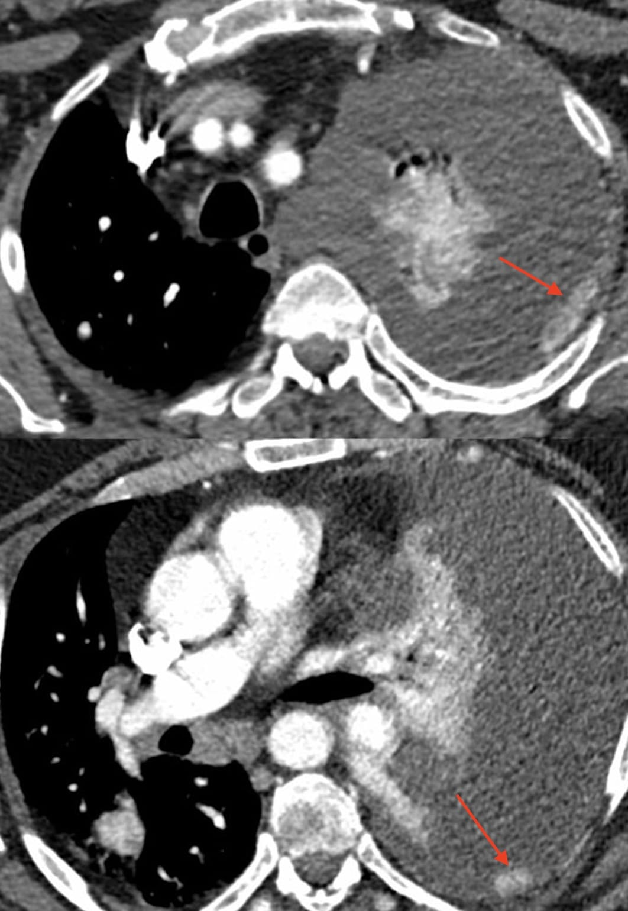

]]


] <!--end of panel-->


] <!--end of panelset-->

<!----------------------------- SLIDE BREAK ----------------------------->

---


class: inverse
name: case 16

.blue[Case 16 ]


.panelset[

.panel[.panel-name[Clinical Presentation]

An "idiopathic" pleural effusion

] <!--end of panel-->

.panel[.panel-name[Imaging]

.pull-left[


]


.pull-right[


]

] <!--end of panel-->

.panel[.panel-name[Explanation]

.pull-left[
Diagnosis: Subtle pleural membrane metastases .red[&xrarr;]

Did you notice the (previously unknown) breast cancer ?  .yellow[&xrarr;]

.grey[Keypoint:

* evaluate the mediastinal pleura carefully for tumor]

]


.pull-right[

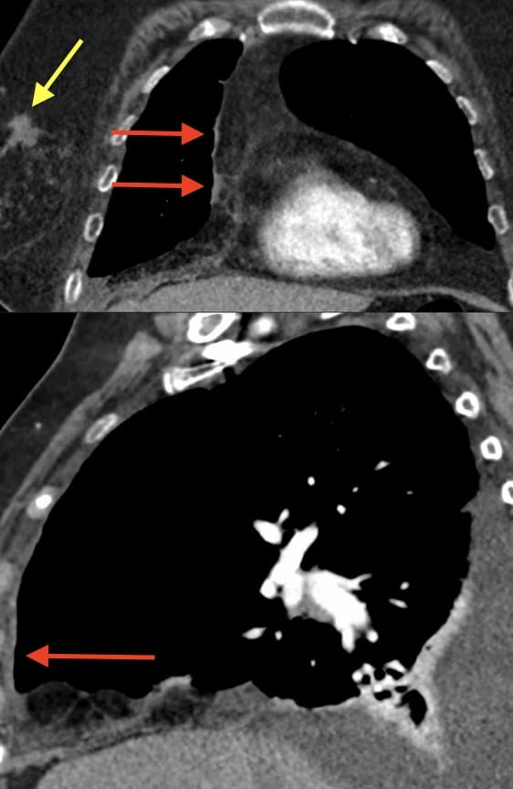

]

] <!--end of panel-->


] <!--end of panelset-->

<!----------------------------- SLIDE BREAK ----------------------------->

---

class: inverse
name: case 17

.blue[Case 17 ]


.panelset[

.panel[.panel-name[Clinical Presentation]

History of colon cancer

] <!--end of panel-->

.panel[.panel-name[Imaging]

<br>

.center[]

] <!--end of panel-->

.panel[.panel-name[Explanation]

.pull-left.w30[

<br>
Diagnosis: Pleural metastases related to interlobar fissures. .red[&xrarr;]

.grey[Keypoint:

* these subtle foci of "flat" pleural thickening are easily overlooked]
]

.pull-right.w70[

<br>
.center[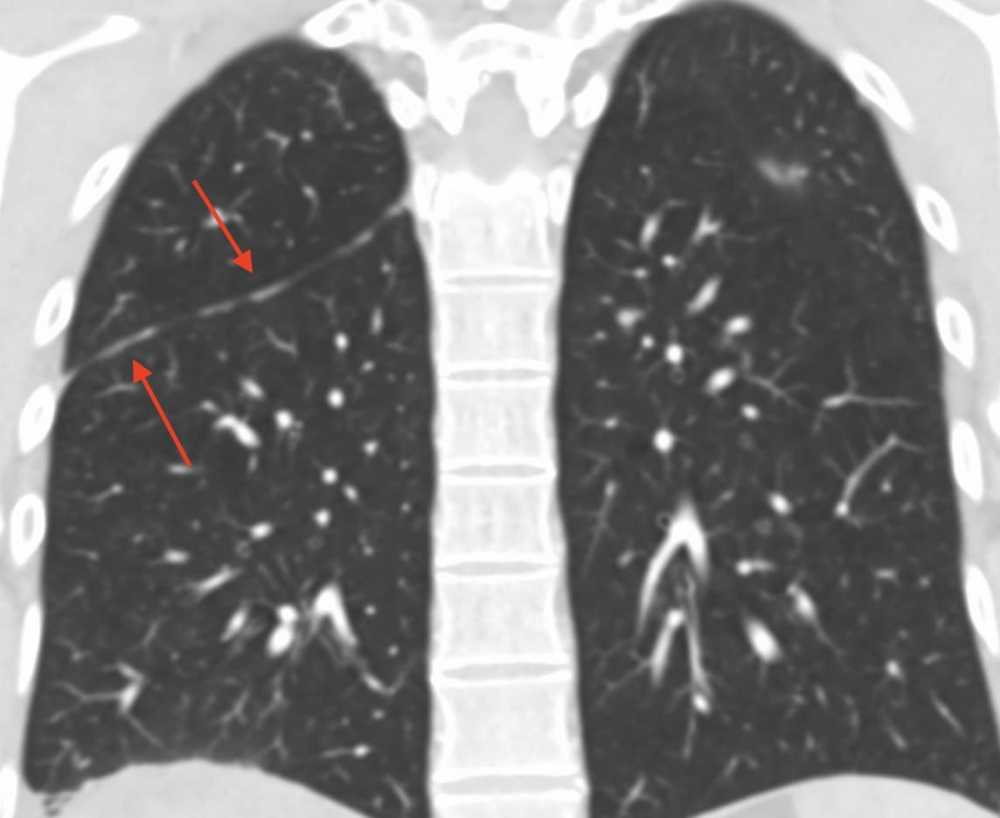]]

] <!--end of panel-->


] <!--end of panelset-->

<!----------------------------- SLIDE BREAK ----------------------------->

---

class: inverse
name: case 18

.blue[Case 18 ]


.panelset[

.panel[.panel-name[Clinical Presentation]

History of gastric cancer

] <!--end of panel-->

.panel[.panel-name[Imaging]

<br>

.center[]

] <!--end of panel-->

.panel[.panel-name[Explanation]

.pull-left.w30[

Diagnosis: Left supra-clavicular nodal metastasis ( in additional to upper abdominal metastases.]

.pull-right.w70[


.center[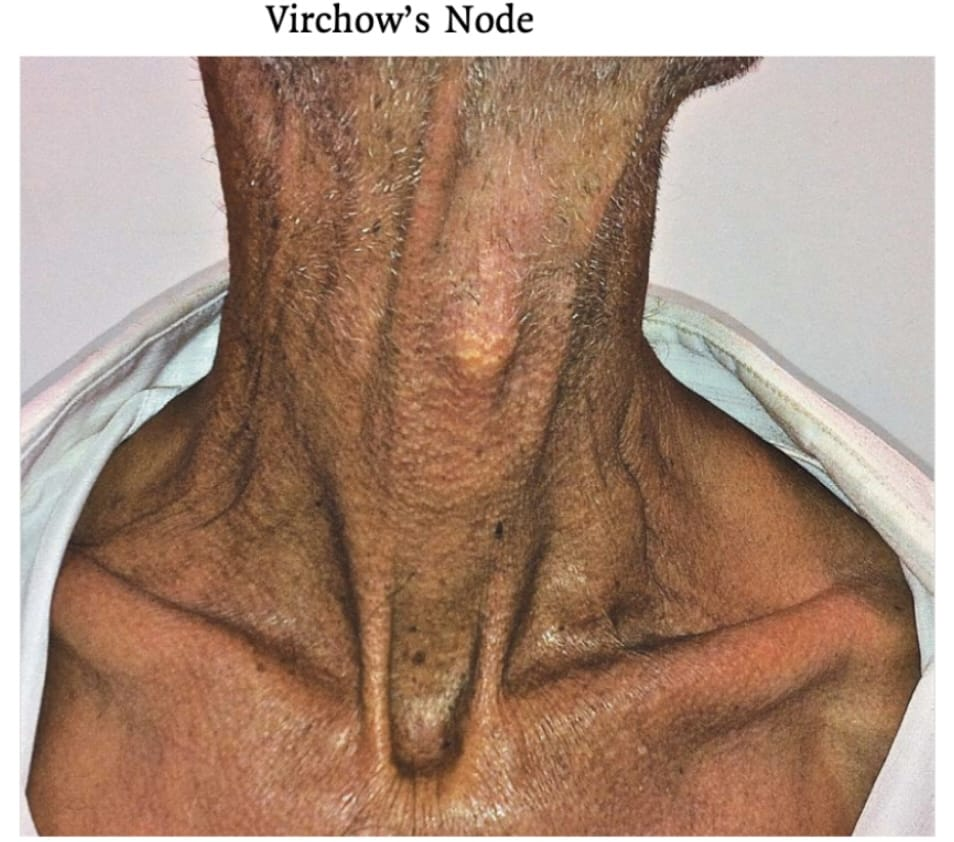]]

] <!--end of panel-->


] <!--end of panelset-->

<!----------------------------- SLIDE BREAK ----------------------------->

---

class: inverse
name: case 19

.blue[Case 19 ]


.panelset[

.panel[.panel-name[Clinical Presentation]

History of breast cancer

] <!--end of panel-->

.panel[.panel-name[Imaging]

<br>

.center[]

] <!--end of panel-->

.panel[.panel-name[Explanation]

.pull-left.w30[

Diagnosis: Left internal mammary nodal metastasis 

.grey[Keypoint: This may be the only site of metastasis]]

.pull-right.w70[


.center[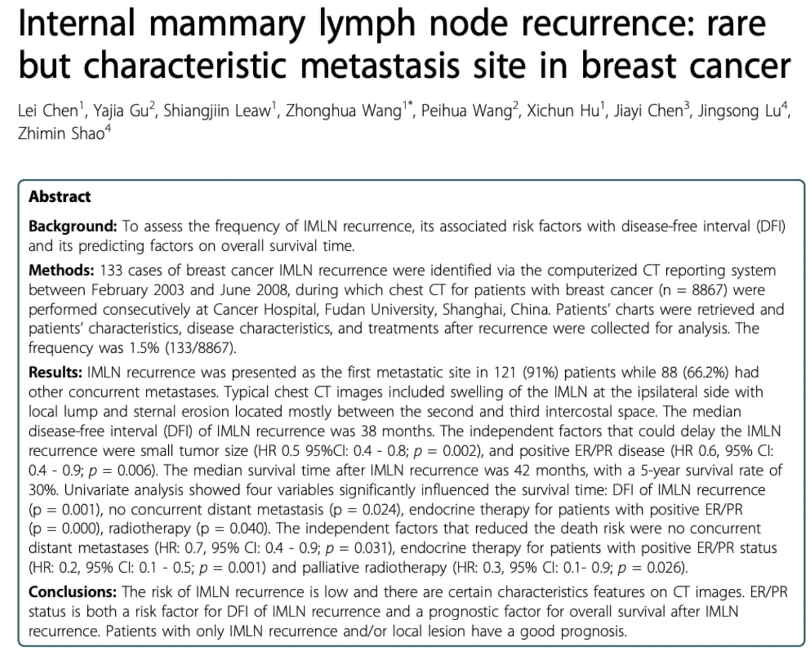]]

] <!--end of panel-->


] <!--end of panelset-->

<!----------------------------- SLIDE BREAK ----------------------------->

---

class: inverse
name: case 20

.blue[Case 20 ]


.panelset[

.panel[.panel-name[Clinical Presentation]

History of an abdominal tumor

] <!--end of panel-->

.panel[.panel-name[Imaging]

<br>

.center[]

] <!--end of panel-->

.panel[.panel-name[Explanation]


.pull-left.w30[

Diagnosis: Calcifications in nodal metastases.]

.pull-right.w70[


.center[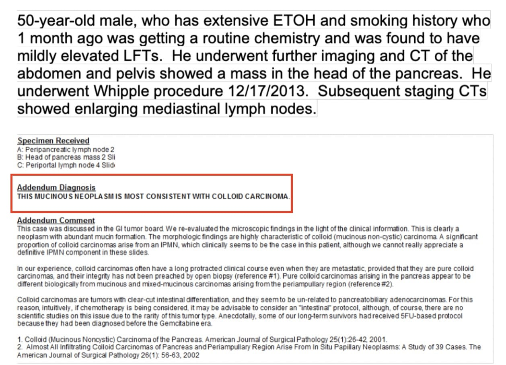]]

] <!--end of panel-->


] <!--end of panelset-->

<!----------------------------- SLIDE BREAK ----------------------------->

---

class: inverse
name: case 21

.blue[Case 21 ]


.panelset[


.panel[.panel-name[Clinical Presentation]

Two patients with extra-thoracic tumors

] <!--end of panel-->

.panel[.panel-name[Patient I]

A patient with melanoma

.center[]

] <!--end of panel-->


.panel[.panel-name[Patient II]

A patient with an extremity sarcoma

.center[]

] <!--end of panel-->

.panel[.panel-name[Explanation]

.big[Diagnosis: Myocardial metastases

.grey[Keypoints:

* These are not uncommonly overlooked.
* Primary cardiac lymphoma may also produce similar findings]]

] <!--end of panel-->


] <!--end of panelset-->

<!----------------------------- SLIDE BREAK ----------------------------->

---

class: inverse
name: case 22

.blue[Case 22 ]


.panelset[

.panel[.panel-name[Clinical Presentation]

A patient with chest discomfort, elevated CVP, and pulsus paradoxus

] <!--end of panel-->

.panel[.panel-name[Imaging]

<br>

.center[]

] <!--end of panel-->

.panel[.panel-name[Explanation]

.pull-left.w30[

<br>
Diagnosis: Pericardial metastases.

.grey[Keypoint:

* primary pericardial tumors are very uncommon]

]

.pull-right.w70[

<br>
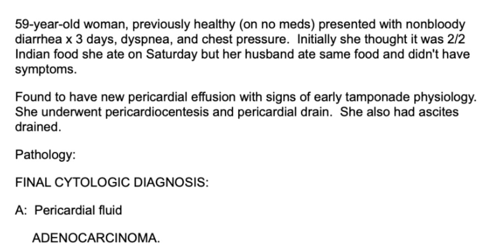]


] <!--end of panel-->


] <!--end of panelset-->

<!----------------------------- SLIDE BREAK ----------------------------->


```{css echo=FALSE}
.highlight-last-item > ul > li, 
.highlight-last-item > ol > li {
  opacity: 0.2;
}
.highlight-last-item > ul > li:last-of-type,
.highlight-last-item > ol > li:last-of-type {
  opacity: 1;
}
```
  
